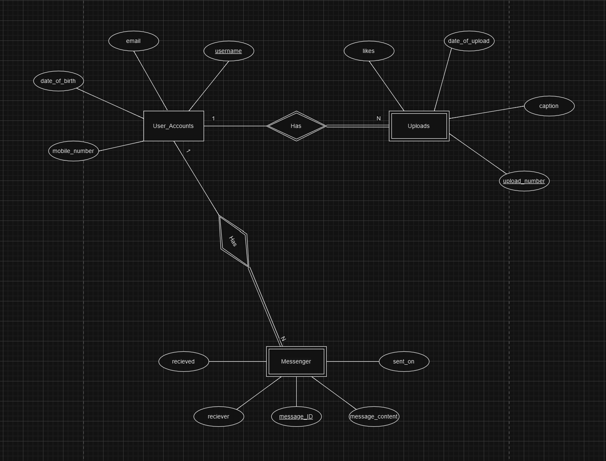

# Social Media MySQL Database

A relational database project that models a simple social media platform using Python, MySQL and CSV data.

The project creates a MySQL database, builds related tables, imports sample data, runs SQL queries and displays a basic likes-frequency chart.

## Overview

The database is built around three entities:

- `User_Accounts`
- `Uploads`
- `Messenger`

Each upload and message belongs to a user account. The schema uses primary keys, foreign keys and cascading deletes so related uploads and messages are removed when a user account is deleted.

The project demonstrates database design, relational modelling, SQL querying, CSV importing and Python-MySQL integration.

## Repository Contents

```text
.
├── code/
│   ├── database_schema_analysis.py   # Creates the database, loads CSVs, runs queries
│   ├── user_accounts.csv
│   ├── uploads.csv
│   └── messenger.csv
├── docs/
│   └── erd.png                       # Entity relationship diagram
├── ERD.drawio                        # Editable source for the diagram
├── requirements.txt
├── LICENSE.txt
└── README.md
```

## Entity Relationship Model



`User_Accounts` is the parent entity. Every upload and every message must belong to
exactly one account, giving a one to many relationship in both directions. Deletes
cascade from `User_Accounts`, so removing an account removes its uploads and
messages rather than leaving orphaned rows.

The editable diagram source is `ERD.drawio`.

## Normalisation

All three tables satisfy 1NF and 2NF, and have no transitive dependencies between
non-prime attributes, so all three meet 3NF. `User_Accounts` also satisfies
Boyce-Codd Normal Form, since `username` is its only determinant. `Uploads` and
`Messenger` fall short of BCNF because `username` is a non-key determinant in each.

## Tech Stack

- Python
- MySQL
- mysql-connector-python
- CSV
- Plotly

## Database Schema

### `User_Accounts`

```text
username       primary key
email
date_of_birth
mobile_number
```

### `Uploads`

```text
upload_number  primary key
username       foreign key -> User_Accounts(username)
caption
date_of_upload
likes
```

### `Messenger`

```text
message_ID     primary key
username       foreign key -> User_Accounts(username)
message_content
sent_on
received
receiver
```

## Features

- Creates the MySQL database automatically.
- Creates all three tables with primary and foreign keys.
- Uses `ON DELETE CASCADE` for linked user data.
- Imports user, upload and message data from CSV files.
- Runs SQL queries across single and joined tables.
- Displays a Plotly chart showing upload-like distribution.

## Implemented Queries

The script runs queries that:

- print captions of uploads with exactly 100 likes;
- identify users who uploaded or sent a message on `2023-12-03`;
- print emails for users with messages marked as not received;
- count the number of unique user accounts;
- find the date of birth of the user linked to the most-liked upload;
- visualise the frequency of likes across uploads.

## Setup

Install dependencies:

```bash
pip install -r requirements.txt
```

Make sure MySQL is installed and running locally.

Update the connection details in `code/database_schema_analysis.py`:

```python
connection = mysql.connector.connect(
    host="localhost",
    user="your_mysql_username",
    password="your_mysql_password"
)
```

## Running the Project

The script reads the CSV files from its own directory, so run it from `code/`:

```bash
cd code
python database_schema_analysis.py
```

The script connects to MySQL, creates `socialmedia_database`, creates the tables,
imports the CSV data, runs the SQL queries, opens the Plotly chart and closes the
connection.

## Re-running

The CSV files use fixed primary keys. Running the script repeatedly against the same populated database may cause duplicate key errors.

To reset before re-running:

```sql
DROP DATABASE socialmedia_database;
```

Then run `database_schema_analysis.py` again.

## Limitations

- MySQL credentials must be added manually.
- Duplicate handling is not implemented for repeated imports.
- The project uses a small local dataset.
- This is a command-line database implementation, not a full web application.

## What This Demonstrates

This project demonstrates relational database design, MySQL table creation, CSV data loading, SQL query writing, key/foreign-key enforcement, cascading deletes and Python integration with a database backend.

## Dataset notice:

The CSV files in this repository are small synthetic sample datasets created for academic database modelling and portfolio demonstration. They do not contain real social media data, real user accounts, personal data, credentials, or confidential information.

## Usage Notice

This repository is provided for portfolio and review purposes only.

All rights are reserved. No permission is granted to copy, redistribute, submit, or reuse this work, in whole or in part, for academic coursework, assessment, or commercial purposes.
